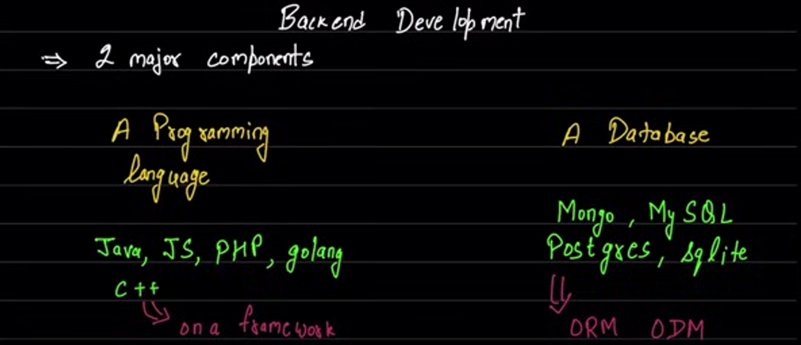
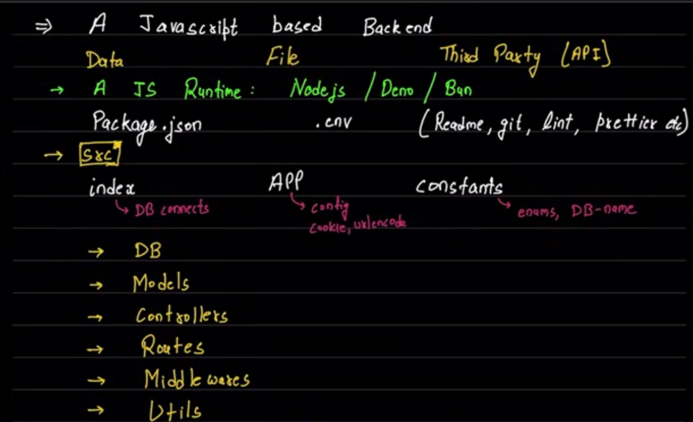

# File Structure

```bash
Package name
|-  .env             : `readme, git, etc`
|-  Package.json     : `npm libraries`
|-  src              : `main folder`
    |-  index.html   : `entry point`
    |-  App          : `some configs`
    |-  Constants    : `enums and structure`
|-  DB               : `All Database work`
|-  Models           : `data structure model`
|-  controllers      : `All the functions`
|-  Router           : `all paths working`
|-  MiddleWare       : `?` 
|-  Utils            : `use from everyware`
| -  More (Dependent)
```